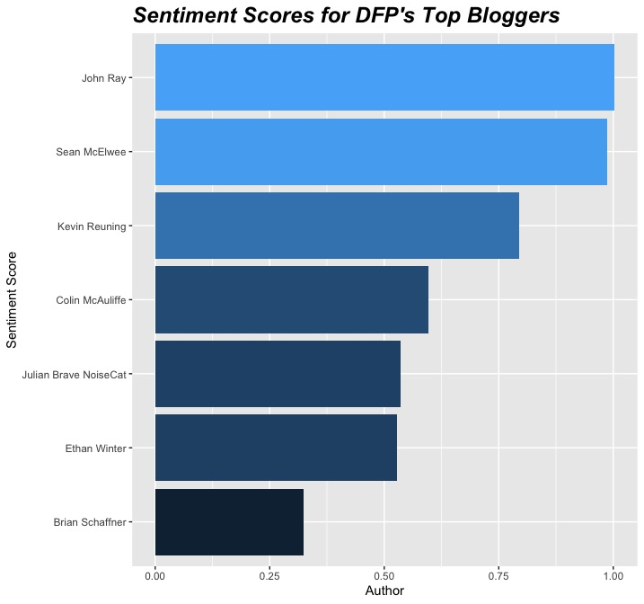

# Analyzing the Data For Progress blog posts

As part of my application, I have done a bit of web-scraping and analysis on [DFP's blog](https://www.dataforprogress.org/blog). I hope you don't mind, and regardless I will make this code private as soon as the application is complete. 

Using the 333 posts (at time of publishing), I did a quick sentiment analysis with help from the [tidytext package](https://www.tidytextmining.com). Aside from what is in my email, I also quickly plotted __overall blog sentiment in 2019 and 2020:__

I also compared the __most frequent bloggers by sentiment:__

And finally, because you might be wondering "what determines sentiment?", here are __your blog's overall most common words arranged by their positive/negative scores:__

I hope that you have some questions, and I would be happy to break things down more! I would be new to polling, but I wanted to demonstrate that I can bring some general technical skill instead. I love your work, and would be honored to join your team.

__Thank you for your consideration, and hope you enjoyed!__
